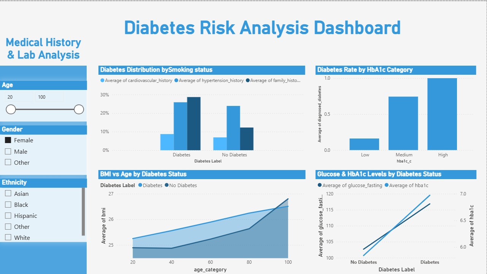
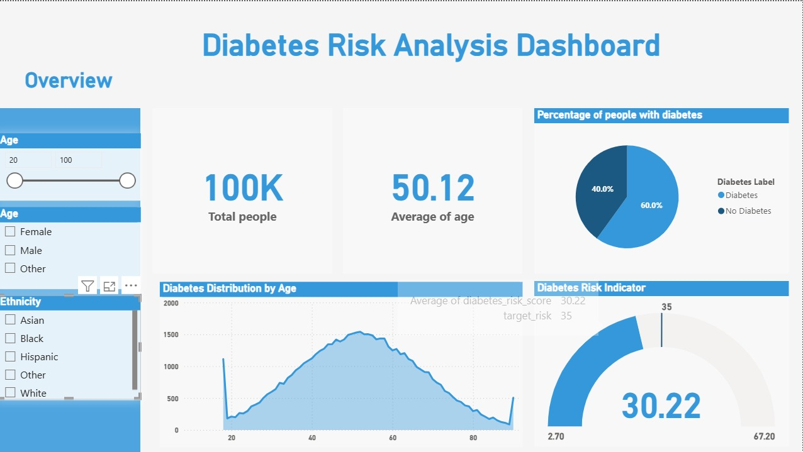
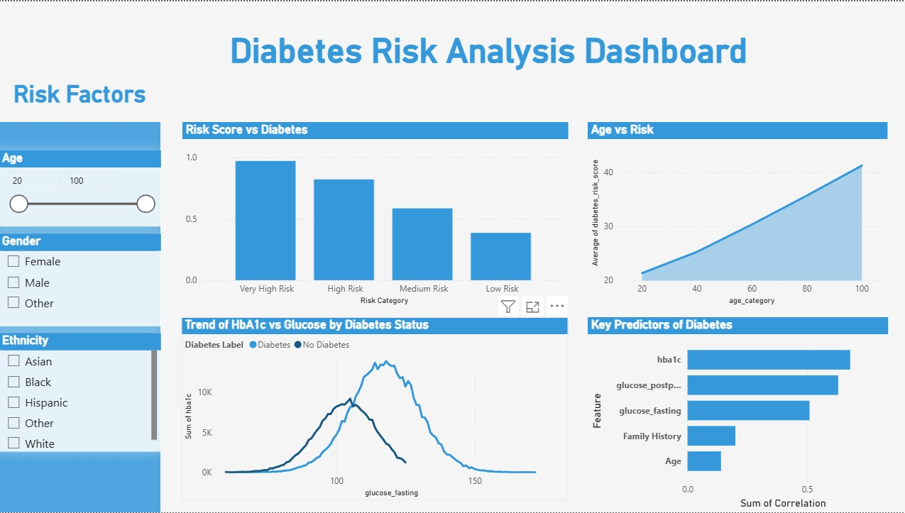
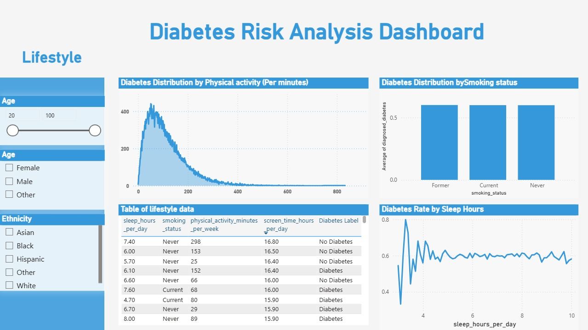

# 🩺 Diabetes Risk Analysis Dashboard

<div align="center">


</div>

---

## 📌 Project Overview

> A comprehensive **medical data analysis** project examining diabetes risk factors across **100,000 patient records** — exploring the role of age, BMI, glucose levels, HbA1c, lifestyle habits, and more.

```python
project = {
    "dataset":      "Diabetes Risk Dataset",
    "records":      100_000,
    "diabetes_rate": "40%",
    "avg_age":      50.12,
    "tools":        ["Power BI", "Python", "Pandas", "Scikit-Learn"],
    "pages":        ["Overview", "Medical History", "Risk Factors", "Lifestyle"],
    "goal":         "Identify key predictors of diabetes risk"
}
```

---

## 📊 Dashboard Preview

### 📋 Page 1 — Overview
> 100K total patients, 40% diabetes rate, age distribution, and diabetes risk indicator (avg: 30.22).



### 🏥 Page 2 — Medical History & Lab Analysis
> HbA1c category analysis, BMI vs Age trends, smoking history impact, glucose & HbA1c levels comparison.



### ⚠️ Page 3 — Risk Factors
> Risk score categories (Very High → Low), age vs risk score trend, HbA1c vs glucose distribution, key predictors ranking.



### 🏃 Page 4 — Lifestyle
> Physical activity distribution, smoking status impact, sleep hours vs diabetes rate, detailed lifestyle data table.



---

## 🔍 Key Insights

| # | Insight |
|---|---------|
| 🩸 | **HbA1c** is the strongest predictor of diabetes — #1 key factor |
| 📊 | **Glucose levels** (fasting + postprandial) are the 2nd and 3rd most important features |
| 👨‍👩‍👧 | **Family history** plays a significant role in diabetes risk |
| 📅 | **Risk increases linearly with age** — clear trend from 20 to 100 |
| ⚖️ | **BMI rises with age** and is consistently higher in diabetic patients |
| 😴 | **Sleep around 6–7 hours** correlates with lower diabetes rates |
| 🚬 | Smoking status shows **nearly equal distribution** across diabetes groups |
| 📈 | **40% of patients** in the dataset are diagnosed with diabetes |

---

## 🔑 Top Predictors (Feature Importance)

```
HbA1c              ████████████████████  ~0.55
Glucose (postprandial) ██████████████████  ~0.50
Glucose (fasting)  ████████████████      ~0.45
Family History     ████████              ~0.22
Age                ████                  ~0.12
```

---

## 🛠️ Technical Approach

### Dashboard Filters (Slicers)
- 🎚️ **Age slider** — range 20 to 100
- ⚧️ **Gender** — Female / Male / Other
- 🌍 **Ethnicity** — Asian / Black / Hispanic / Other / White

### Key Visuals Built
| Visual | Description |
|--------|-------------|
| 🥧 Pie Chart | Diabetes vs No Diabetes percentage |
| 📈 Area Chart | Diabetes distribution by age |
| 🌡️ Gauge | Diabetes risk indicator (2.70 – 67.20) |
| 📊 Bar Charts | Risk categories, HbA1c categories, top predictors |
| 🔵 Scatter Plots | BMI vs Age, Glucose vs HbA1c trend |
| 📋 Table | Lifestyle data — sleep, smoking, activity, screen time |

---

## 📁 Project Structure

```
diabetes-risk-analysis/
│
├── 📂 data/
│   └── diabetes_dataset.csv
│
├── 📂 notebooks/
│   └── eda_diabetes.ipynb
│
├── 📂 dashboard/
│   └── DiabetesRisk.pbix
│
└── 📄 README.md
```

---

## 📈 Results Summary

<div align="center">

| Metric | Value |
|--------|-------|
| 👥 Total Patients | **100,000** |
| 🩺 Diabetes Rate | **40%** |
| 📅 Average Age | **50.12 years** |
| ⚠️ Avg Risk Score | **30.22 / 67.20** |
| 🔑 Top Predictor | **HbA1c Level** |
| 📉 Lowest Risk Age | **~20 years** |
| 📈 Highest Risk Age | **~80–100 years** |

</div>

---

<div align="center">


**Made with 🩺 by [Mahmoud](https://github.com/YOUR_USERNAME)**

</div>
